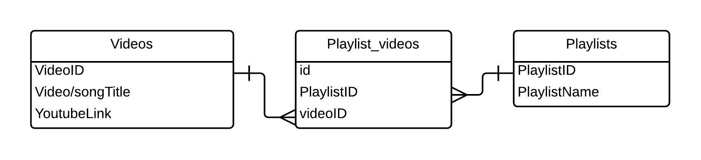

# VideoPlaylist backend

This project was generated with Spring Initializr.

## Prerequisites

- Java 8
- MySQL
- IntellJ IDEA

## Project setup

- Clone this repository.
- Create a mysql database
- Set up the following environment variables

| Variable name |                      Value                           |
|:--------------|:-----------------------------------------------------|
|    `DB_URL`   | *your local database url*/***{your database name}*** |
| `DB_USERNAME` |           ***{your local mysql username}***          |
| `DB_PASSWORD` |           ***{your local mysql password}***          |

### Entity Relationship Diagram

### Endpoints

- `GET`
  - */videos*: get all videos
  - */videos/:id*: get video with id
- `POST`
  - */videos*: add new video
- `PUT`
  - */videos/:id*: modify the video with id
- `DELETE`
  - */videos/:id*: delete the video with id 